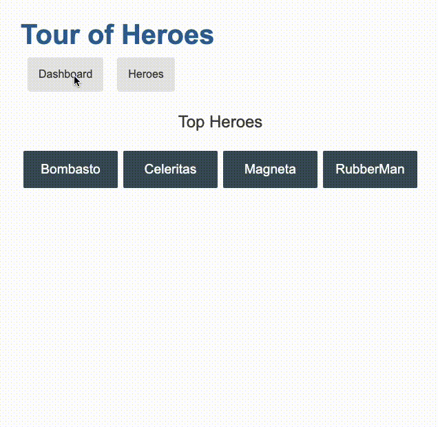

# Angular Tutorials - Tour of Heroes

Based on: https://angular.io/tutorial/tour-of-heroes

## App Interface

<p align="center"></p>

<p align="center"></p>

## Development server

Run `ng serve` for a dev server. Navigate to `http://localhost:4200/`. The application will automatically reload if you change any of the source files.

## Code scaffolding

Run `ng generate component component-name` to generate a new component. You can also use `ng generate directive|pipe|service|class|guard|interface|enum|module`.

## Build

Run `ng build` to build the project. The build artifacts will be stored in the `dist/` directory.

## Running unit tests

Run `ng test` to execute the unit tests via [Karma](https://karma-runner.github.io).

## Running end-to-end tests

Run `ng e2e` to execute the end-to-end tests via a platform of your choice. To use this command, you need to first add a package that implements end-to-end testing capabilities.

## Further help

To get more help on the Angular CLI use `ng help` or go check out the [Angular CLI Overview and Command Reference](https://angular.io/cli) page.

## Angular concepts

For essential angular concepts, see the README of previous tutorials at https://github.com/jobsonita/studies-angular-setupstartguides#readme

### Conditional classes

When we want to apply classes to an element based on certain conditions, we can do the following:

```html
<div [class.myclassname]="some_condition">
  <p>This div will have the myclassname class applied to it when some_condition is true.</p>
</div>
```

### Data fetching, error handling and search field

This tutorial gives a good example on how implement these features. I strongly recommend reading it: https://angular.io/tutorial/tour-of-heroes/toh-pt6
